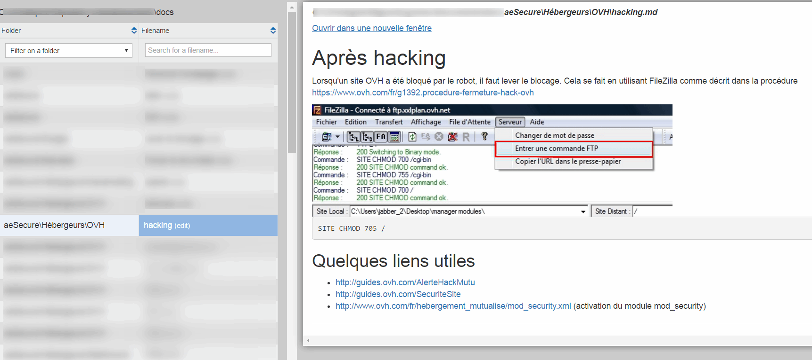
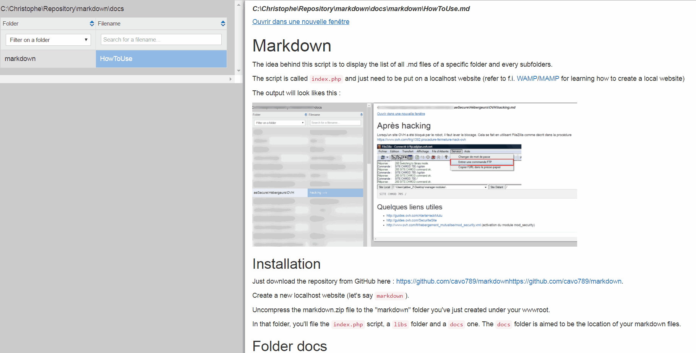

# Markdown v0 - December 2016 #

The idea behind this script is to display the list of all .md files of a specific folder and every subfolders.

The script is called `index.php` and just need to be put on a localhost website (refer to f.i. [WAMP](http://www.wampserver.com/)/[MAMP](https://www.mamp.info/en/) for learning how to create a local website)  

The output will look like this : 

## Installation ##

Just download the repository from GitHub here : [https://github.com/cavo789/markdown](https://github.com/cavo789/markdown)https://github.com/cavo789/markdown.

Create a new localhost website (let's say `markdown`).

Uncompress the markdown.zip file to the "markdown" folder you've just created under your wwwroot.

In that folder, you'll file the `index.php` script, a `libs` folder and a `docs` one.  The `docs` folder is aimed to be the location of your markdown files.

## Folder "docs" ##

By default, the `index.php` script will scan the `docs` folder.  You can change this in the very first line of the source.

You can too, without changing anything, just create a symbolic links called "docs" but pointing to the folder where, already today, you're saving your .md files.

## Taking notes ##

Take a look on this `HowToUse.md` file : the syntax is the one of markdown (if you don't know this syntax, refer to the official GitHub guide : [https://guides.github.com/pdfs/markdown-cheatsheet-online.pdf](https://guides.github.com/pdfs/markdown-cheatsheet-online.pdf)).

Note that there are a lot of editors, free or commercial, to make life easier. At writing time, I'm using [MarkdownPad 2](http://markdownpad.com/) for Windows.

So, take a look on this `HowToUse.md` file : the syntax is standard except that I'm using an html `img` tag to display images.  Unless you made changes to the PHP script, please respect this : refers to local images that are stored in a subfolder called "images".  So, write your .md file in a folder (f.i. "`howtos`") and, if you need images, create a subfolder ("`howtos/images`") and put images there.   Just like you can see it here, in this file.

## Using the script ##

So, you've create a localhost website and you've call it "`markdown`".  To use the script, just start your local webserver and go to your `http://localhost/markdown` website.

If you've correctly configured your webserver and alias, you'll should see the interface.  Just after the installation of the script, you'll see something like this :

* In the left pane, you'll retrieve the list of .md files found in the /docs folder.
* In the right pane, just after a click on a file, you'll get his HTML output (with image support).

### Left pane ###

The script will scan the /docs folder and will list every single .md files found there; in the root folder and in any subfolder.

The list will be displayed in a table : in the first column the folder structure and, in the second column, the name of the file.

By clicking onto the first column, you'll apply a filter : only files of that specific folder will be displayed.  You can also use the selection at the top of the first column.

By clicking on the second column, on a filename, that file will be displayed but not his markdown content but his html output, converted on the fly.  This conversion is done thanks the script `parsedown` of Emanuil Rusev ([http://erusev.com](http://erusev.com)).

### Right pane ###

By displaying the content, the script will automatically generate a .html file and store that file in the same folder of your .md file.

If you've modify something in your .md file, the .html file will be generated again (thanks to a md5 content comparaison).

The right pane use Bootstrap and contains jQuery lines of code for retrieving the first h1 of the .md content : that heading will be used to initialize the `<title>` of the page.

That preview pane also provide a links "Open in a new window" : click on that link and a new tab will be created on your browser and will display the .html file (no more the .md file).   "Open in a new window" will refers to the local file and no more the `index.php` script.

## Print ##

If you wish to print your document, you don't need to open the file in a new tab, just press CTRL-P or click on the printer icon : thanks to special css style (`@media print`), only the right page and only the content will be sent to the printer.

The list of files and hyperlinks won't be printed. 

## Improve and share ##

The current script has been coded quickly, in a few hours, for helping me to works more efficiently with my .md files.  

Don't be afraid to propose improvements, for sure, a lot of things (like the graphical interface) can be done better.

## Credits ##

Christophe Avonture | [https://www.aesecure.com](https://www.aesecure.com) 

Thank you to 

* Emanuil Rusev for the Parsedown class ([http://erusev.com](http://erusev.com))
* The Bootstrap and jQuery teams