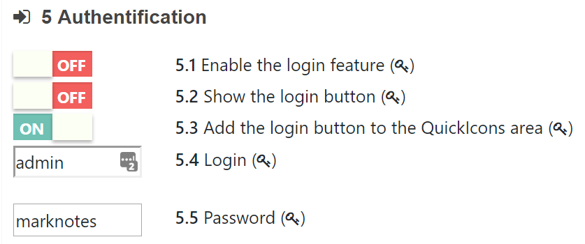

[](https://www.marknotes.fr)

  [](https://www.marknotes.fr) [](https://github.com/cavo789/marknotes) [](https://github.com/cavo789/marknotes/fork)

By **Christophe Avonture**

> If you like marknotes, please give him a :star: and fork it. This way more people can be made aware of its existence. **Thanks!**

Marknotes is a tool that will display your documents through a powerful web interface where they will be sorted and accessible quickly. Marknotes offers multiple features such as a powerful search engine, the ability to encrypt all or part of a document, display it in different ways and export it in multiple ways and much more (see below).

Thanks to its plugin oriented architecture, Marknotes is rich in dozens of features and it is quite easy to add more. Even the buttons in the editor toolbar are plugins! Tasks (like file upload, file format conversion,. ..) are also plugins! The code is highly scalable but also easier to maintain since everything is perfectly divided into small portions of code.

By adopting Marknotes, you'll never ask yourself, "Where did I save my document?" or "I had read an interesting piece of information but I don't know where it is any more". The answer will be, of course, "The information is saved in Marknotes and will really fast retrieve."

**marknotes requires PHP 7.1 or greater and mod_rewrite enabled**

_(There is a [bug in PHP 7.0](https://github.com/php/php-src/blob/PHP-7.1.0beta2/UPGRADING#L321) when working with filenames having accentuated characters (UTF8) so if you wish to use such name, please be sure to use at least PHP 7.1)_

## Table of Contents

1. **[Introduction](#1-introduction)**
2. **[Demo](#2-game_die-demo-site)**
3. **[How to install](#3-how-to-install-or-update-)**
4. **[Documentation](#4-book-documentation)**
5. **[Features](#5-features)**
6. **[Configuration](#6-hammer-configuration)**
7. **[Tips](#7-tips)**
8. **[Debugging](#8-debugging)**
9. **[Privacy and protection](#9-closed_lock_with_key-privacy-and-protection)**
10. **[Author](#10-man-author)**
11. **[Ready to help?](#11-ready-to-help)**
12. **[Support](#12-support)**
13. **[License](#13-license)**

## 1. Introduction

### 1.1 What is marknotes?

Marknotes is a PHP application that you can **self-hosted** and who will help you to manage your "notes": documentation, meeting minutes, user guides, ebooks, emails, ... i.e. everything you put in it.

Notes are written in pure [Markdown](https://daringfireball.net/projects/markdown/syntax): this is a plain text language with only a few codes (like `#` or `*`) for text formatting. Yes!!! You'll write your notes with a very stupid text editor (`Notepad` on Windows will do the work) (note: marknotes provide an online editor) and save them as a flat file on your server.

Marknotes will display your notes in a folder approach and files will be displayed in a nice HTML5 output with a lot of extra features: export the note as a .docx, .epub, .odt, .pdf, .txt, ... file or display it like a slideshow (support of [Reveal.Js](https://github.com/hakimel/reveal.js) and [Remark](http://gnab.github.com/remark) included)

Marknotes is fully Open Source and is using just _stupid_ text files (markdown ones). It's really easy to create files, edit them in any text editor, ... and due to the file format, the integration with any tools and existing process is easy.

**Using markdown requires a very light learning to e.g. know how to put in bold but it goes very fast. The gain is then enormous: you will type your texts without using the mouse any more, with the kilometric keystroke. Really fast.**

### 1.2 Prerequisites

During the development of marknotes, two technical choices have been made:

- Use PHP 7.1 or greater to get benefits of all advantages of the latest version of PHP _and because other versions were, already, obsolete (if you're interested, see [PHP end of life page](http://php.net/eol.php))_.
- Consider that mod_rewrite is on the server enabled; this is needed to have nice URLs like `yoursite/docs/folder/slideshow.reveal` and NOT `yoursite/index.php?task=...&param=...&second=....` i.e. a URL with a very long query string and not really friendly for search engines.

### 1.3 Notes are yours!

Want to move to another application and leave marknotes? No problem! Notes are flat files and written in a text format and use markdown which is a standard.

Even if I'd be really sad to see you leave, you'll certainly not have any problem to do it. Just move your .md files and that's all.

And remember: notes are yours! Unlike Evernote®, Google®, Microsoft® or other companies, notes will be saved on your website only (can be local). If you don't want to put them on the internet, they won't be on the internet at all.

### 1.4 Background

During years, I've used Evernotes to manage my notes (can be documentation, user guides, ebooks, billing, ... i.e. everything I need to keep in one central place and being able to retrieve them easily).

In 2016, Evernote has introduced more restriction with the Free version and by the end of the year, has stated that some employees will have access to **our** notes for administration tasks.

That was too much for me: no, even if the tool was easy and free, no, I didn't want to a human can get access to my knowledge base, I wish to be able to better manage who / when / why and, on top of this, some features were missing for me: easily display notes as an HTML page, as a slideshow, convert them in f.i. a Word document, and so on.

**[⬆ back to top](#table-of-contents)**

---

## 2. :game_die: Demo site

You can find a working demo on [https://www.marknotes.fr](https://www.marknotes.fr). Please take a look.

Marknotes is available in French and in English. The configuration on the demo site is done for French-speaking people. Marknotes uses a text file (json format) for retrieving translations. Want to translate in Dutch, German, Spanish, ...? Don't hesitate.

---

**[⬆ back to top](#table-of-contents)**

## :computer: 3. How to install or update?

Please take in consideration that marknotes needs PHP 7.x. You'll perhaps need to enable PHP 7.x on your server; this can be done through a specific line in the `.htaccess` file or from your control panel (see your hoster if you need more information).

> If you already have a version of marknotes, if this is the old version 1; I recommend removing all files **except the /docs folder** (don't loose your notes!). Otherwise, let files there and overwrite them by using the easy or hard way here below

### 3.1 :smile: Easy way

The simply way to install marknotes is by downloading his [installation script](https://github.com/cavo789/marknotes_install) which is available in a separate GitHub repository.

Download `install.php` from there, save the file in the folder where you wish to install a copy of marknotes and just run the script (f.i. `http://localhost/marknotes/install.php`).

The script will get the latest version of marknotes, download his zip from GitHub and save it on your server, unzip the file and prepare the site. After two seconds, you should have a running site.

### 3.2 :muscle: Hard way

You can, of course, download a copy of this repo by getting the [ZIP version](https://github.com/cavo789/marknotes/archive/master.zip) or making a clone (`git clone https://github.com/cavo789/marknotes`).

You'll find the source files in the `/src` folder. Take a copy of all these files and put them in your marknotes folder.

### 3.3 :hatched_chick: Update marknotes

Once installed, if enabled, your marknotes installation will check on github if there is a newer version. If so, an icon will be displayed on your toolbar (by default in the upper right part of the screen). Just click on the icon and after you agree, the newer version will be installed.


---

**[⬆ back to top](#table-of-contents)**

## 4. :book: Documentation

Marknotes's documentation is available on the marknotes demo site: [https://www.marknotes.fr](https://www.marknotes.fr). See the marknotes entry.

You can also find a "not-updated-version" documentation on the wiki here: [https://github.com/cavo789/marknotes/wiki](https://github.com/cavo789/marknotes/wiki) **that documentation needs review**

---

**[⬆ back to top](#table-of-contents)**

## 5. :trophy: Features

Thanks to his dozens of plugins, there are many functionalities like:

- Works perfectly in offline mode (since all notes are files stored on your disk)
- Login screen to get access to feature like add / delete / rename notes or folder
- Online editor for allowed people
- Cache mode enable (on the server and on the local browser)
- Note's encryption to hide sensitive data's and show it only to logged in people
- ACLs to restrict visibility of folders to a few users (people not on the `whitelist` won't see protected folders)
- Automatic rendering of tables: table of content, todos list, decisions taken list, ...
- Variables replacement: create your own variable like f.i. `%VERSION%`, `%AUTHOR%`, `%CUSTOMER_NAME%`, ...
- File inclusions so you can write very big documentation in smaller files and publish the master document without effort
- Image gallery plugin
- Exportation to .docx, .epub, .odt, .pdf, .txt, ...
- Slideshows mode (`reveal.js` or `Remark`)
- Each templates can be overridden; define yours
- Powerful search functionnalities allowing multi-word search and using caching functionality too
- Multiple languages support
- and much more

And, if a feature is missing, consider writing your own plugin, it's really easy.

### Plugins

Just a few ideas of existing plugins...

#### Include

Marknotes comes with a lot of plugins, somes are really basic like the `lastmod` one (make easy to show the last modification date of the note), somes are really powerful.

One of them is the include plugin. Imagine that you have to write a very long documentation: you will immediately think in chapter and subchapter, you will cut your material in main and appendices. You could write a single note in which you write everything; this note could be thousands of lines long and become unmanageable. **And documentation that is complex to update is dead documentation**.

But you could also write dozens of notes for each part of your document (a note per sub-chapter then a note to consolidate those notes into a chapter then a note to consolidate all the chapters; a final note that will consolidate the whole as well as the appendices).

You will have much easier to maintain your long documentation, you will be able more easily to make reread sections (which will be autonomous notes), make them translate, etc.. You will have all the facilities to move them from one chapter to another, to reverse their order, etc..

You can also subcontract parts: such note for such contributor (ideal when you wish to make a presentation where different actors follow one another; you create the main note which would include the notes of each speaker).

The Include plugin is undoubtedly one of the most powerful. The plugin will merge the documents into a single document that you can then view or export as if it were one and only one document.

Example:

```markdown
# Our famous KeyNote...

%INCLUDE christophe.md%
%INCLUDE marc.md%
%INCLUDE loic.md%
%INCLUDE david.md%
```

#### ListFiles

On another one is ListFiles who will scan a folder (and its subfolders if recursiveness is enabled) and generate a list of files as hyperlinks.

For example, you have a "Miscellaneous Documents" note where you would use the ListFiles plugin and it would be enough to upload the files on your server so that, without even modifying the note, they appear as hyperlinks.

Example:

```markdown
# Documentation

## Main

...

## Appendices

%LISTFILES appendices/\*%
```

#### Conversions

Of course, every conversion plugins that will make easy to reuse your content: you write in markdown and you can display your content like a slideshow (`Reveal.Js` and `Remark`), export as a Microsoft Word document (`.docx`), Adobe Reader (`.pdf`), Open Office Document (`.odt`) and many more.

#### Favorites

But there are also plugins for making the interface easier to use like the Favorites plugin : want to retrieve easily the link to your note? Add it into your favorites.

**[⬆ back to top](#table-of-contents)**

## 6. :hammer: Configuration

Marknotes will fit yours needs, without any exceptions: you can change everything by overwriting the [settings.json](https://github.com/cavo789/marknotes/blob/master/src/settings.json.dist) file.

Every setting are indeed stored as a value-key entry in the [settings.json](https://github.com/cavo789/marknotes/blob/master/src/settings.json.dist) file.

The master file is called `settings.json.dist` and is stored in the root folder of marknotes. That file is part of the repository so **don't change it** (because on the next update of marknotes, settings.json.dist will be replaced by a fresh copy).

Marknotes has a `Settings` screen built-in: through the interface you'll be able to update more than 250 settings easily. Use the interface, don't modify the file manually.

_Below an example for the `Authentification` plugin_



_Start of july 2018, there are 230 settings that can be configured there._

Marknotes will always first read `settings.json.dist` and, only then, if a file called `settings.json` exists, will load that second file. In other words: marknotes will read his default settings and will load yours then. So, yours will overwrite the default one.

In fact, the `settings.json` shouldn't be a full copy of `settings.json.dist` but, it's the best approach, should only contain the updated value.

For instance, if you wish to change the value of the `site_name` property, your settings.json should (can) only contains this:

```json
{
  "site_name": "My awesome documentation site"
}
```

And that's all since, like explained here above, marknotes will first read `settings.json.dist` (he'll get all default settings) and you only need to say: please overwrite the `site_name` setting and take mine.

The example below show how you can modify more than one setting: here, you'll set your regional settings to fr-FR and you'll also mention that the folder contains notes isn't the default `docs` folder but, on your site, is called `my_notes`.

You can use this approach and overwrite every single setting of marknotes.

```json
{
  "regional": {
    "locale": "fr-FR",
    "language": "fr"
  },
  "folder": "my_notes",
  "site_name": "My awesome documentation site"
}
```

### Hierarchy approach

**And more**

The file settings.json can be placed in your root folder (then will apply to every notes) but you can also place this file in a given folder.

Let's imagine this structure:

```text
 /docs
  /GitHub
 /repo_1
 /repo_2
  /marknotes
 /en
 / ... (a lot of subfolders)
 /fr
 / ... (a lot of subfolders)
 /nl
```

You've a lot of subfolders in `/docs` and, for marknotes, you've three subfolders, one by language (English, French or Dutch).

In the folder `/docs/marknotes/en`, you can decide to use international settings like f.i.

```json
{
  "regional": {
    "locale": "en-GB",
    "language": "en"
  },
  "site_name": "My awesome documentation site"
}
```

while, in `/docs/marknotes/fr`, you'll have

```json
{
  "regional": {
    "locale": "fr-FR",
    "language": "fr"
  },
  "site_name": "Mon site de documentation"
}
```

The `settings.json` file **can be placed in any folder of your site** and you can have more than one `settings.json` file, marknotes will always respect the `hierarchy` (just like Apache does with a .htaccess file f.i.):

1. `/settings.json.dist`
2. `/settings.json`
3. `/docs/settings.json`
4. `/docs/marknotes/settings.json`
5. `/docs/marknotes/fr/settings.json`

And one more step: you can name the file `my_note.json` and store it in the same folder of `my_note.md` so the file will only apply for that specific note and not every note of the folder.

---

**[⬆ back to top](#table-of-contents)**

## 7. :bulb: Tips

### GitHub - Synchronization

Thanks to GitHub, you can synchronize your documentation folder (by default, folder called `/docs`) with your online site.

The idea is to manage your notes on your localhost, the /docs folder can be a specific repository saved on GitHub. By updating yours notes, simply push changes to GitHub.

There, on github.com, in the `settings` of your repository, add a web hook. This mechanism will can a specific URL on every changes of the repository.

On my own, I use the `deploy.php` script (you'll find the script [here](https://github.com/cavo789/git_scripts/tree/master/deploy)) of [Marko Marković](https://github.com/markomarkovic). This script will download the repo and install the latest version.

So, by pushing your notes from your computer to GitHub, github.com will call your website and the site will download and install the latest version. So simple.

### Convert Word or ODT files

[Marknotes_convert](https://github.com/cavo789/marknotes_convert) is a script for Windows that will convert, in a batch mode, every single `.docx` and `.odt` files into `.md`.

So, if you already have a lot of documentation, **good news**, you can convert them to the markdown language and use them in the marknotes's interface.

---

**[⬆ back to top](#table-of-contents)**

## 8. :hammer: Debugging

If you wish to debug marknotes, please [read the documentation](readme_debugging.md)

## 9. :closed_lock_with_key: Privacy and protection

> Everything is yours, for now and always

Please read [Privacy and protection: everything is yours, for now and always](readme_privacy.md) to obtain a lot of information concerning privacy and how to secure access to your notes.

## 10. :man: Author

marknotes has been created and is maintained by [Christophe Avonture](https://github.com/cavo789) | [https://www.aesecure.com](https://www.aesecure.com)

## 11. :hand: Ready to help

MarkNotes is maintained by one person in his spare time.

MarkNotes needs your help!

- Use it!
- Add a star in the project page.
- Tell others about MarkNotes.
- Suggest improvements (templating, CSS, PHP, images, documentation, ...)
- Test and report [issues](issues), [help to fix them](issues) or [implement new features](pulls)

Note: before working on a big change, please, post first an issue and explain to me your idea. Just to be sure that we're aligned and that nobody will work a lot and can have disappointment.

Thanks in advance!

## 12. :question: Support

The support is done through [GitHub Issues](https://github.com/cavo789/marknotes/issues); however depending on a single person and his free time, taken on leisure time, the support (as well as the development of new features) will depend on his ability to be available.

## 13. :ledger: License


You are free to copy, modify, and distribute Marknotes with attribution under the terms of the MIT licence. See the [LICENSE](LICENCE) file for details.

**[⬆ back to top](#table-of-contents)**

> If you like marknotes, please give him a :star: and fork it. This way more people can be made aware of its existence. **Thanks!**
