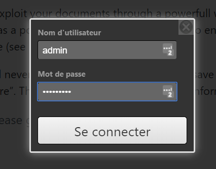
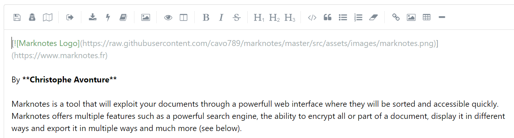
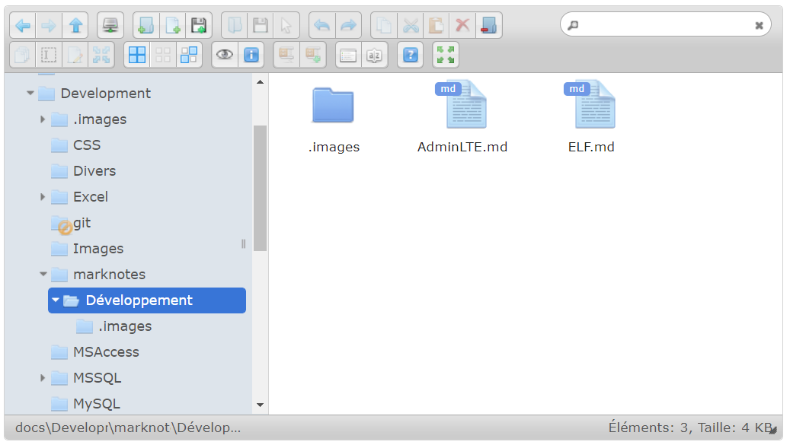
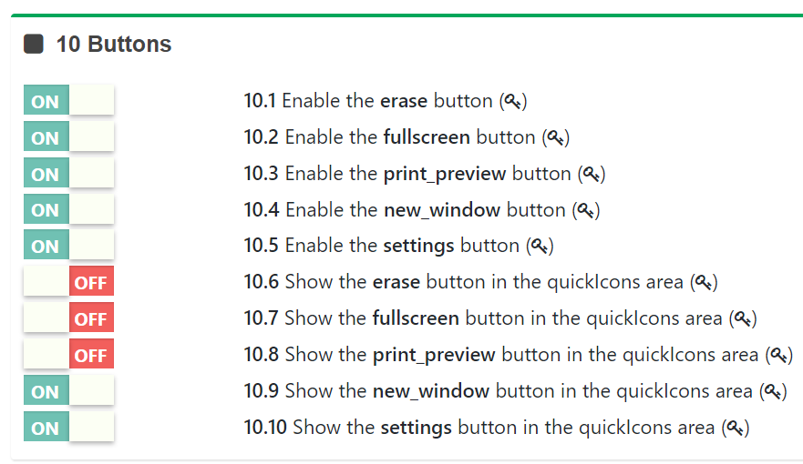
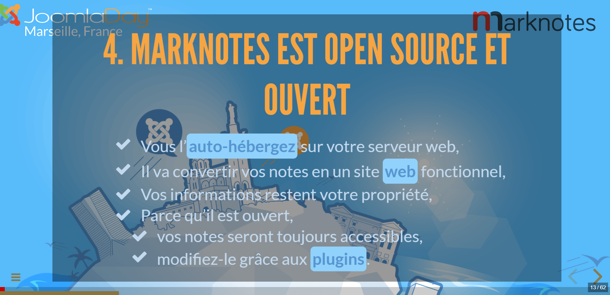

# Introduction to marknotes

The default credentials are **admin** / **marknotes**. You'll need them for editing notes and to change settings to yours (language, regional info, plugins, ...). Please click on the :fa-sign-in: button that you can see at the top right. Once connected, please change these credentials by clicking on the Settings button (icon is :fa-gears:), then click on the fourth 'tab' (icon is :fa-sun-o:) of the menu and click on the "Update application's settings" item (icon is :fa-toggle-on:). You'll find the credentials in the "Authentication" part.{class=note}

%TOC_5%

## In a few words

Marknotes is a PHP application that you can self-hosted and who will help you to manage your "notes": documentations, meeting minutes, user guides, ebooks, emails, ... i.e. everything you put in it.

You'll write your information with a very basic text editor program (even `Notepad` on Windows OS) and you can, of course, edit them through the interface.

Notes are stored in a text file (with a `.md` extension). Sensitive part can be encrypted like logins, passwords, credit card numbers, ...

## Documentation

You can find the documentation on the wiki here: [https://github.com/cavo789/marknotes/wiki](https://github.com/cavo789/marknotes/wiki) but I encourage you to play with the [demo](https://www.marknotes.fr) so you can quickly see how the application works.

## Screenshots

### The main interface

The left side of the screen displays your notes.

The upper part of the screen shows a ribbon with a search engine and buttons (fully personalizable).

Most of the screen is devoted to displaying your documentation.

### The login screen

The default login is **admin** and the default password is **marknotes**. Please modify them quickly once marknotes has been installed. If you want, you can let these fields empty and everybody can then edit your notes (perfect on a localhost system f.i.){class=note}

To be able to manage notes and to configure marknotes, you need to provide a login and a password. But, if you wish, you can disable this f.i. on a localhost: the user will be immediatly authenticated in that very special situation.

### The editor

Notes can be edited online (or not; it just depends on your configuration).

The editor provide a lot of features like, for instance,

* encrypt data,
* retrieve the HTML content of any page accessibly publicly on the internet and, too, convert that HTML note to a markdown one,
* insert a table of contents, last update date/time,
* ...

**The file manager**

You can display a file manager (also on your production site of course) which will allow you to f.i. reorganise your folder structure, create new folder, renaming them, ...

The most important feature: you can drag and drop files/folders from your computer directly to your site. And that's really nice !

### Configuration screen

You can manage more than 200 configuration items directly from a settings page.

Here, below, f.i. the configuration of buttons.

### Display your content

Of course, you can display your notes in HTML but not only: you can display them as slideshows.

Below an example with a customized template (html and css).

You can export the note in different file format (docx, epub, odt, pdf, txt, ...).

## Demo site

The demo is available on [https://www.marknotes.fr](https://www.marknotes.fr)

## Credits

Christophe Avonture | [https://www.aesecure.com](https://www.aesecure.com)

This application could not have been created without the **amazing Open Source community**.

A tremendous thank you to every library maintainers who give time and robust software (like, a.o.t, AdminLTE, Bootstrap, FontAwesome, jQuery, jsTree, Parsedown, Reveal.js, ...)

Thank you to GitHub.
