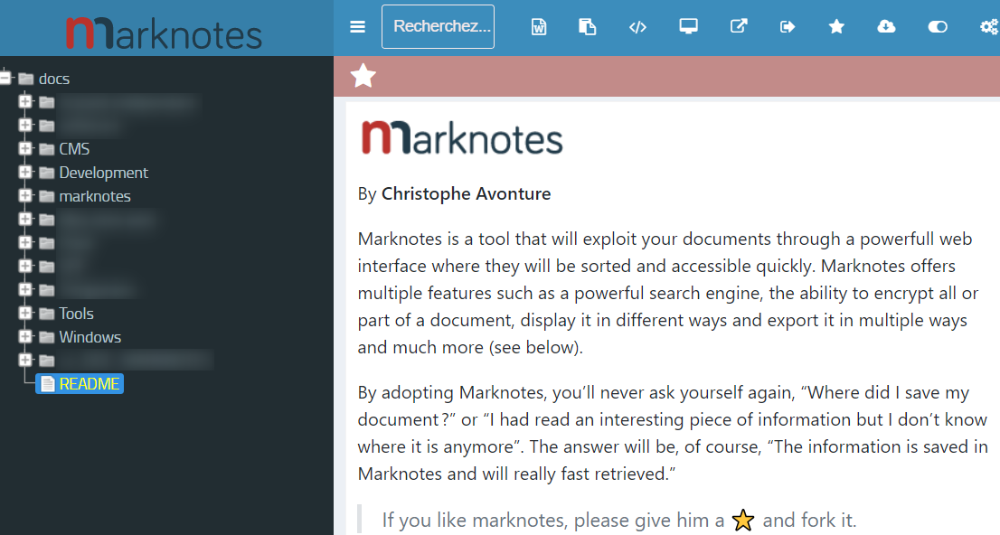

# marknotes v1.1

## Documentation

You can find the documentation on the wiki here : [https://github.com/cavo789/marknotes/wiki](https://github.com/cavo789/marknotes/wiki)

## Demo site

The demo is available on [https://www.marknotes.fr](https://www.marknotes.fr)

## Credits

Christophe Avonture | [https://www.aesecure.com](https://www.aesecure.com)

### Thank you to, not exhaustive,

    - Alberto Júnior for [jquery-albe-timeline](https://github.com/Albejr/jquery-albe-timeline)
    - Alexander Farkas for [lazysizes](https://github.com/aFarkas/lazysizes)
    - Bartek Szopka for [jquery.highlight.js](http://bartaz.github.io/sandbox.js/jquery.highlight.html)
    - Contributors of [DataTables](https://github.com/DataTables/DataTables)
    - Contributors of [Dompdf](https://github.com/dompdf/dompdf)
    - Contributors of [Font Awesome](https://github.com/FortAwesome/Font-Awesome)
	- Contributors of [monolog](https://github.com/Seldaek/monolog)
    - Contributors of [Prism](http://prismjs.com)
    - Contributors of [remark](https://github.com/gnab/remark)
    - Contributors of [simplemde-markdown-editor](https://github.com/NextStepWebs/simplemde-markdown-editor)
    - Damien Alexandre for [JolyTypo library](https://github.com/jolicode/JoliTypo) - Web Microtypography fixer
    - Emanuil Rusev (erusev) for the [Parsedown](https://github.com/erusev/parsedown) class ([http://erusev.com](http://erusev.com))
    - Ivan Bozhanov (vakata) for [jsTree](https://github.com/vakata/jstree)
    - Joseph Lenton for [PHP-error](https://github.com/JosephLenton/PHP-Error)
    - Marcus Westin for [store.js](https://github.com/marcuswestin/store.js)
    - Nedim Arabaci for the [noty](https://github.com/needim/noty) plugin
    - Paul Kinzett for [jquery-toolbar](https://github.com/paulkinzett/toolbar)
    - Sérgio Dinis Lopes for the [jQuery Flexdatalist](https://github.com/sergiodlopes/jquery-flexdatalist) plugin
    - SoapBox Innovations for [linkifyjs](https://github.com/SoapBox/linkifyjs)
    - Tim Connell for [jquery-print-preview](https://github.com/etimbo/jquery-print-preview-plugin) plugin
    - Zero Rocha for the [clipboard.js](https://github.com/zenorocha/clipboard.js) plugin
    - The [Bootstrap](https://github.com/twbs/bootstrap) and [jQuery](https://github.com/jquery/jquery) teams
